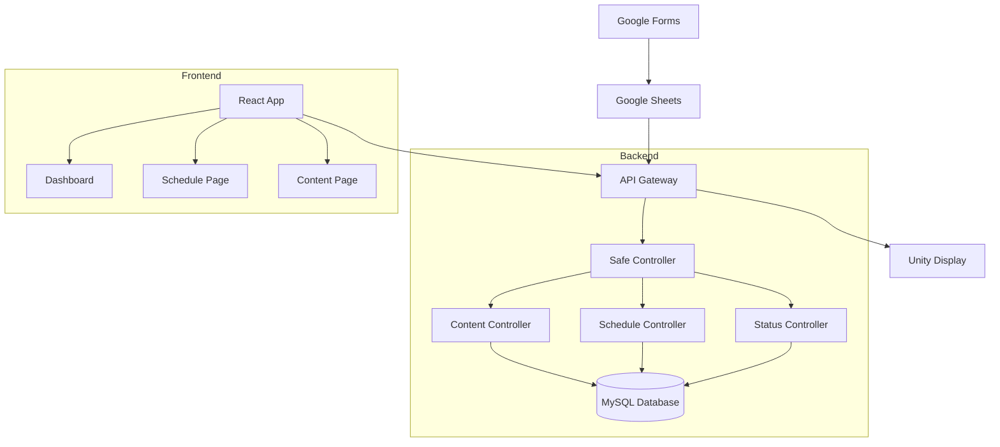
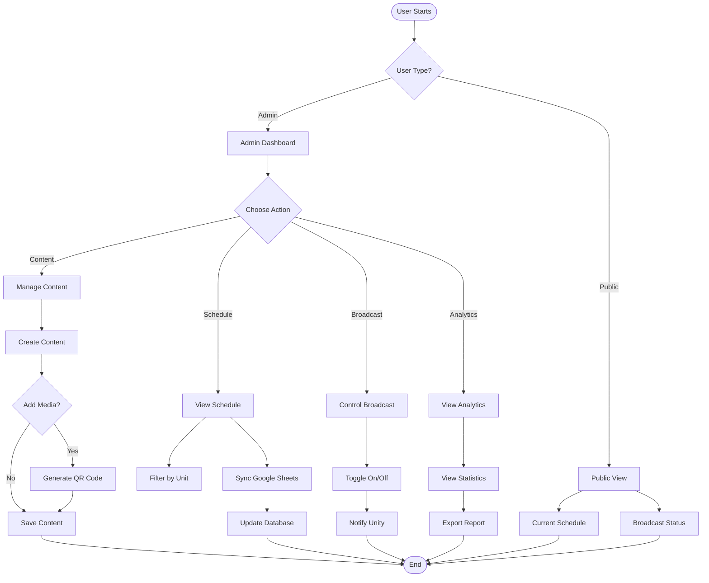
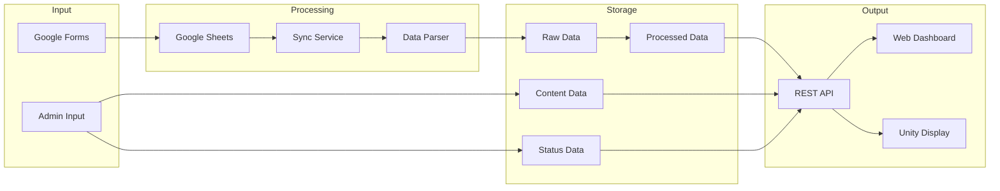
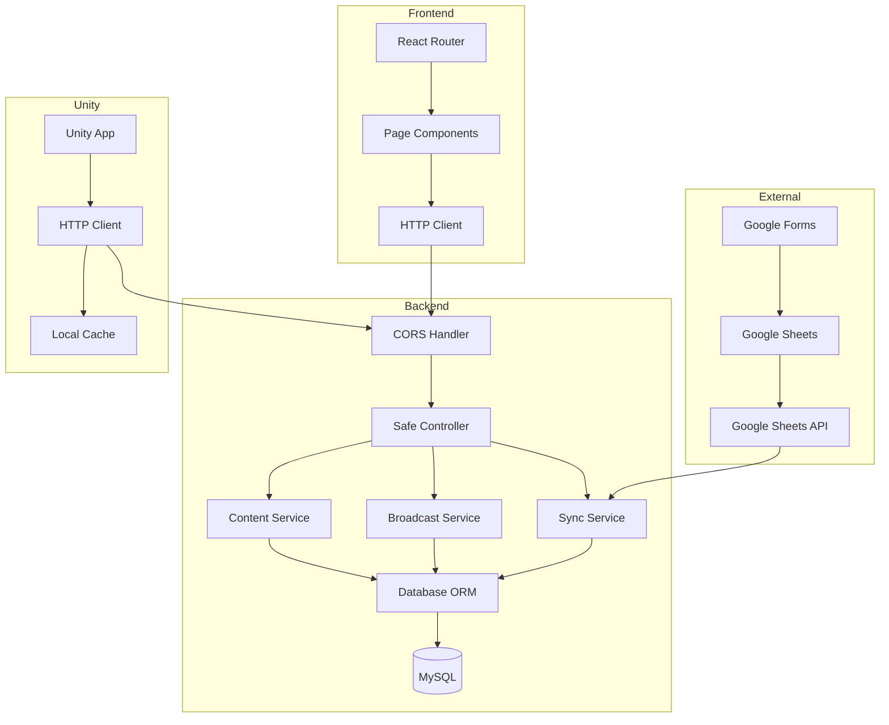
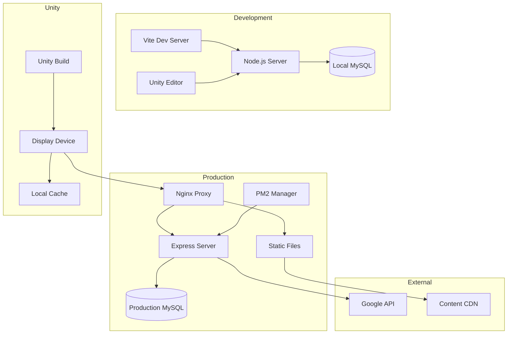
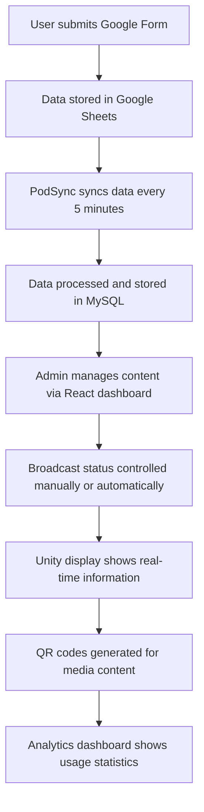

# MERMAID FLOWCHARTS UNTUK PODSYNC

## 1. SYSTEM ARCHITECTURE FLOWCHART

## 2. USER FLOW FLOWCHART

## 3. DATA FLOW FLOWCHART

## 4. SYSTEM INTEGRATION FLOWCHART

## 5. DEPLOYMENT ARCHITECTURE FLOWCHART

## 6. SIMPLE PROJECT OVERVIEW

---

## CARA PENGGUNAAN

1. **Copy kode Mermaid** yang diinginkan (tanpa markdown header)
2. **Buka** https://mermaid.live
3. **Paste kode** ke editor
4. **Render diagram** akan otomatis muncul
5. **Export** sebagai PNG/SVG

## KETERANGAN FLOWCHARTS

1. **System Architecture**: Arsitektur sistem yang disederhanakan
2. **User Flow**: Alur penggunaan yang mudah dipahami
3. **Data Flow**: Alur data dari input ke output
4. **System Integration**: Integrasi komponen utama
5. **Deployment Architecture**: Deployment development vs production
6. **Simple Project Overview**: Overview keseluruhan project

Semua flowchart sudah **disederhanakan** dengan menghilangkan detail yang tidak perlu untuk fokus pada alur utama sistem PodSync.