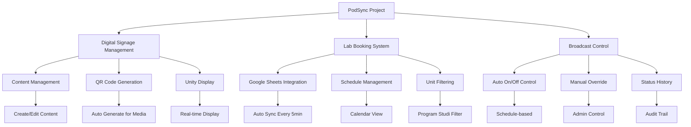
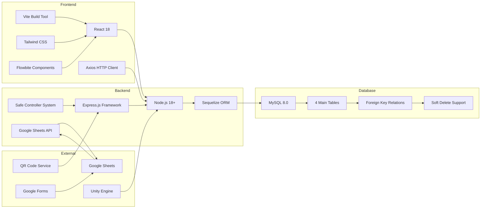
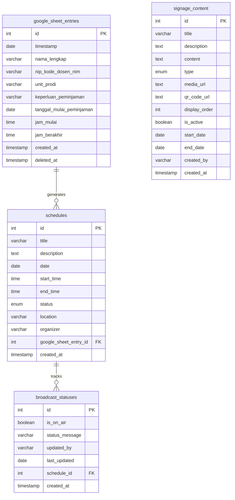
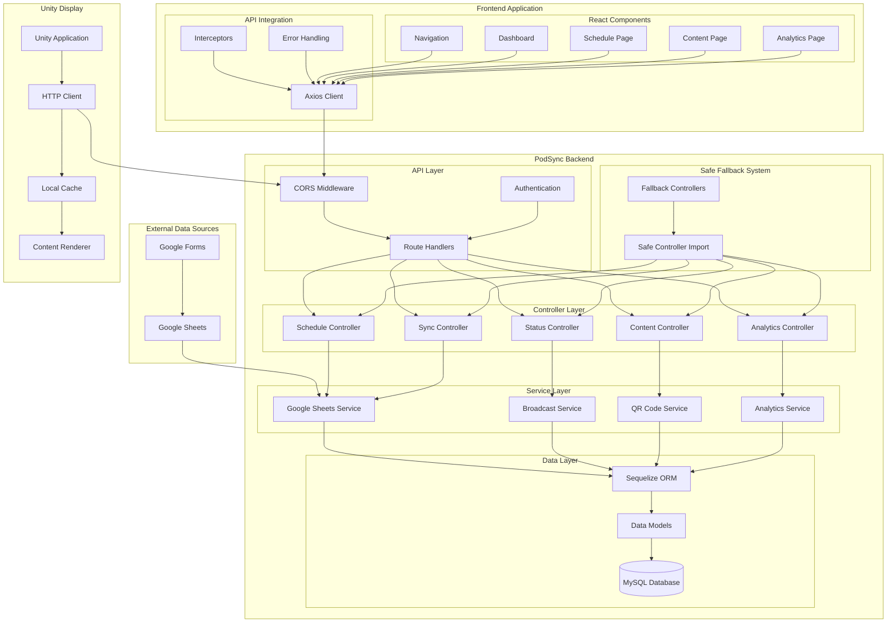
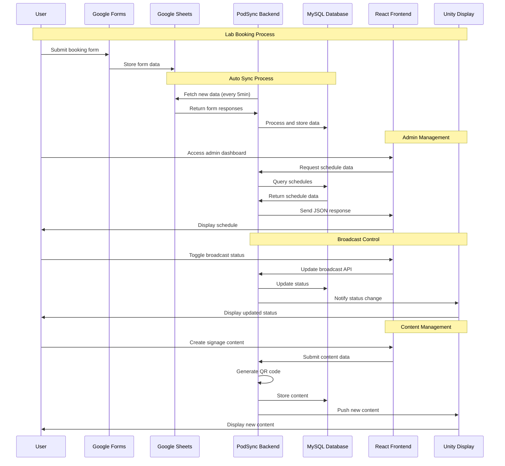
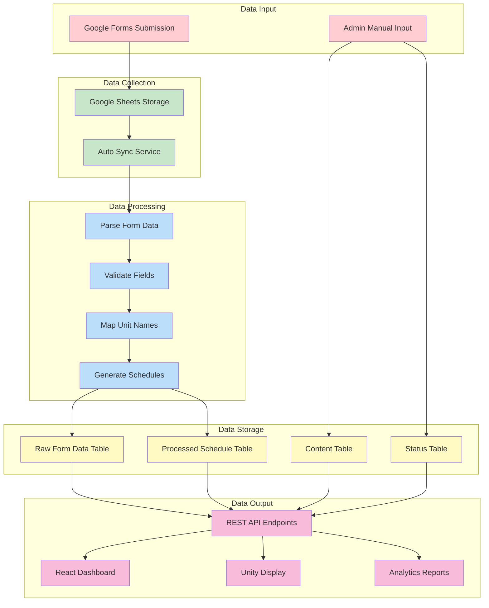
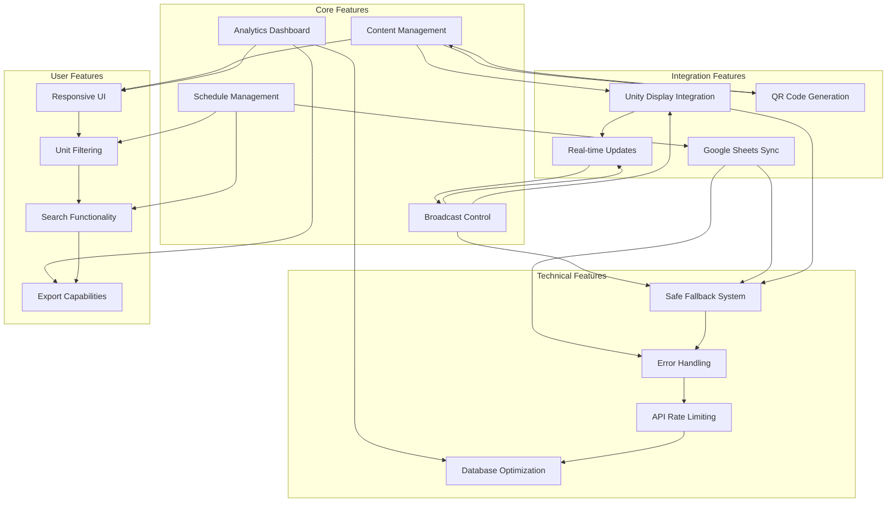
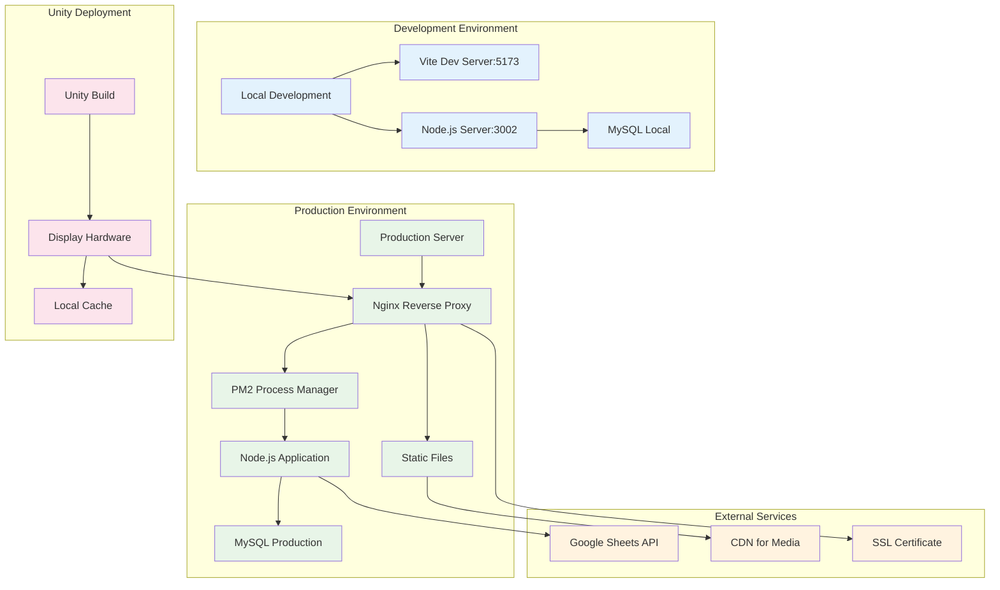
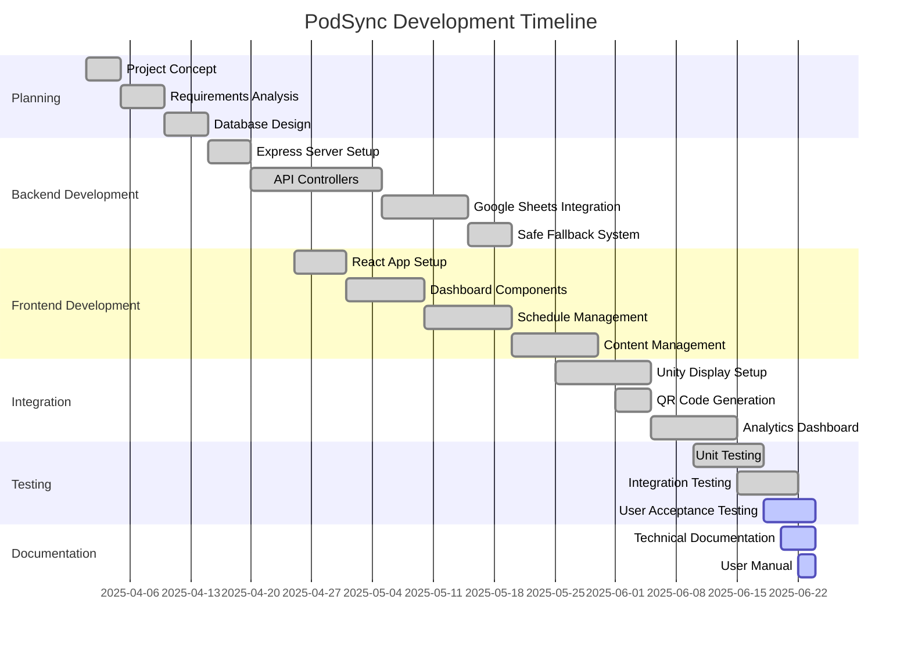
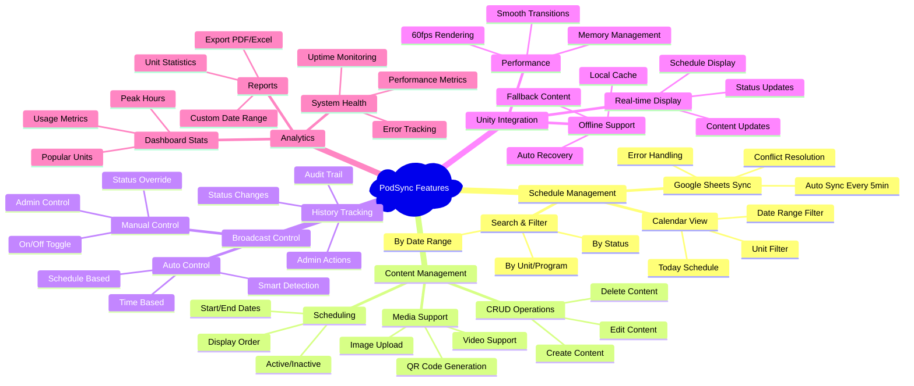

# PROJECT PODSYNC - MERMAID DIAGRAMS

## 1. PROJECT OVERVIEW DIAGRAM



## 2. TECHNOLOGY STACK DIAGRAM



## 3. DATABASE ENTITY RELATIONSHIP DIAGRAM



## 4. APPLICATION ARCHITECTURE DIAGRAM



## 5. USER INTERACTION FLOW DIAGRAM



## 6. DATA PROCESSING FLOW DIAGRAM



## 7. SYSTEM COMPONENTS DIAGRAM



## 8. DEPLOYMENT ARCHITECTURE DIAGRAM



## 9. PROJECT TIMELINE DIAGRAM



## 10. FEATURE BREAKDOWN DIAGRAM



---

## CARA PENGGUNAAN

Untuk menggunakan diagram-diagram di atas:

1. **Copy kode Mermaid** yang diinginkan (dimulai dari ````mermaid` hingga ````)
2. **Buka** https://mermaid.live 
3. **Paste kode** ke editor
4. **Render diagram** akan otomatis muncul
5. **Export** sebagai PNG/SVG sesuai kebutuhan

## KETERANGAN

- **Graph TD/LR**: Top-Down atau Left-Right flow
- **Flowchart**: Advanced flowchart dengan berbagai shapes
- **SequenceDiagram**: Menampilkan interaksi antar sistem
- **ErDiagram**: Entity Relationship untuk database
- **Gantt**: Timeline project development
- **Mindmap**: Feature breakdown dalam bentuk mind map

Setiap diagram menggunakan **color coding** dan **styling** untuk memudahkan pemahaman struktur project PodSync.